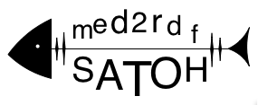

## MED2RDF

The med2rdf project develops converters and provides RDF data of biomedical databases.

### Project resources

* This [Web site](http://www.med2rdf.org/) and the [GitHub Pages](https://github.com/med2rdf/website) source contents
  * See [instructions](USAGE) for the online editor, Jekyll and Markdown
* [GitHub repository](https://github.com/med2rdf)
* [Google groups](https://groups.google.com/forum/#!forum/med2rdf)
* [Google drive](https://drive.google.com/open?id=0B-rUd_Q0C7HvdmJaaVBoT1QtSTA)

### Biomedical databases

Currently we are working on the following databases:

* dbSNP
* dbVar
* dbNSFP
* ExAC
* gnomAD
* ClinVar
* DGIdb
* COSMIC
* CiVic
* HiNT
* INstruct
* HGNC

etc.

### RDF data models

* Ontologies for above biomedical databases
  * Ontology commonly used among databases
  * Ontology specific to each database
* Human chromosome ontology
* Standardization of variation representation

